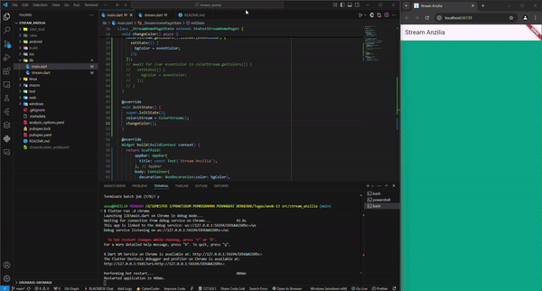

# streambuilder_anzilia

362358302044_NUR ARDINA ANZILIA PUTRI_2D TRPL

Soal 3
Jelaskan fungsi keyword yield* pada kode tersebut!
yield* Keyword:
- Digunakan untuk mem-forward (meneruskan) semua elemen dari stream lain ke stream yang sedang dihasilkan.
- Alih-alih memanggil yield berulang kali untuk setiap elemen stream yang diteruskan, yield* memungkinkan integrasi seluruh stream sekaligus.

Apa maksud isi perintah kode tersebut?
Kode tersebut bertujuan untuk membuat stream warna (Stream<Color>) yang menghasilkan elemen warna secara berulang-ulang dari daftar warna bernama colors. 

Soal 4

Soal 5
 Jelaskan perbedaan menggunakan listen dan await for (langkah 9) ! :
Perbedaan antara listen dan await for adalah listen digunakan untuk memantau stream dengan callback dan memungkinkan kita menghentikan atau melanjutkan stream, sedangkan await for dipakai dalam fungsi async untuk memproses data dari stream satu per satu secara berurutan.

## Getting Started

This project is a starting point for a Flutter application.

A few resources to get you started if this is your first Flutter project:

- [Lab: Write your first Flutter app](https://docs.flutter.dev/get-started/codelab)
- [Cookbook: Useful Flutter samples](https://docs.flutter.dev/cookbook)

For help getting started with Flutter development, view the
[online documentation](https://docs.flutter.dev/), which offers tutorials,
samples, guidance on mobile development, and a full API reference.
